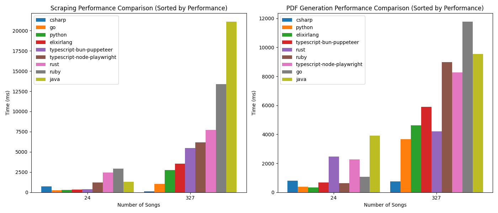

# What is this?

When i was starting in the world of programming, i thought i needed to know all the languages so i will be a real programmer, and then everybody started telling me to pick just one and master it, they told me not to try and learn how to write hello world in 50 languages.  

Now, 5 years apart from that, i know that i don't need to, but i want to, so i will take a project that i made ([Cifraclub list to pdf](https://github.com/jramosss/cifraclub-cancionero)), since it's a really tiny project that demonstrates value really fast so i will grab that and try to make it in as many languages as i can, and i will try to make it in the most idiomatic way possible, so i will be learning the language while doing it.

I will be documentating my journey in this repository, so expect big things.

## Project idea

If you are a musician, you probably know the website [Cifraclub](https://www.cifraclub.com/). It is a great website to find chords and tabs for your favorite songs. However, if you want to have all your songs in one place, you'll have to go through the process of downloading every song individually. This can be a very time-consuming process. This is why I created this script. It will download all songs from your list and save them in a PDF file.

Base project structure is simple
- A scraper that fetchs the list url, returns a list of songs, and *parallelly* fetchs the song page and returns the song content
- A util to gather the html and apply styles
- A pdf parser file that takes the generated html to create a pdf file
- A benchmark file that runs the docker container and measures the time it takes to run the script

## Research

Inside every language folder there is a readme with my opinion and conclussions about the language.

## Performance comparision between languages

## TO-DOS:
- Prettier CLI
- More languages