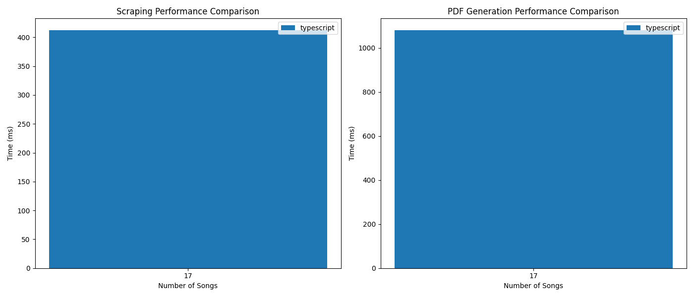

# Cifraclub to PDF - Typescript w bun + puppeteer

## How to run
- `bun install`
- `bun start`

## Conclusions:
- Great for concurrency, super easy, just use `Promise.all()`
- Not as good performance as i thogught it would be
- Bun is not ready yet (version 1.2.4 - 9/3/25), using the bun server instead of express or hono turned out to be a stick in my wheel.
- Playwright is not working with bun as of today (https://github.com/oven-sh/bun/issues/15679)
- Puppeteer works the same as Playwright for this use case

## Benchmark
